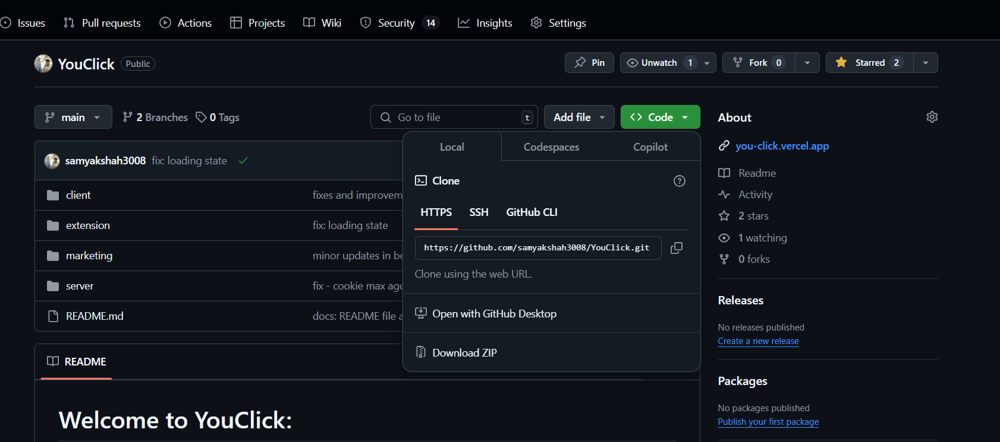
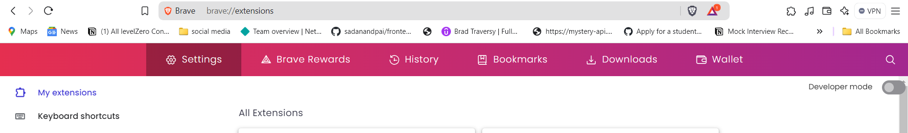
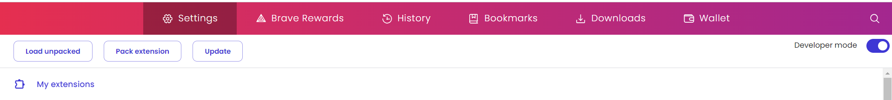
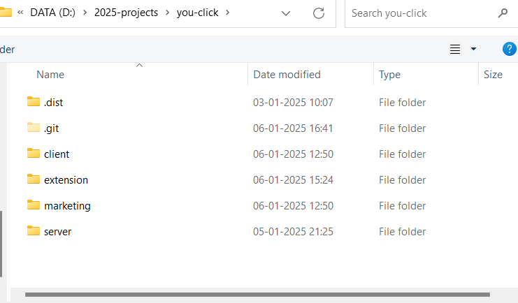
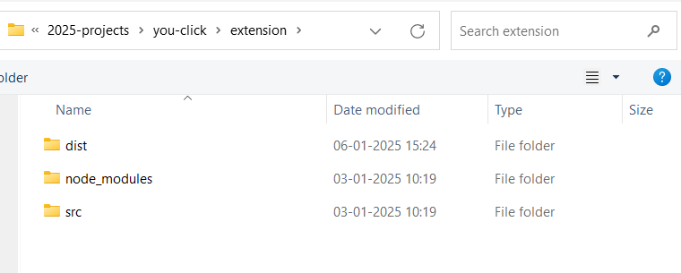
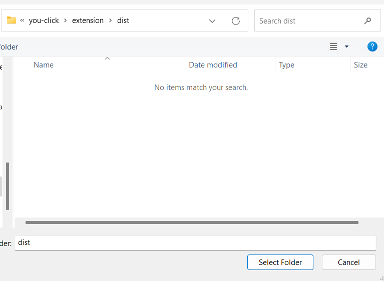
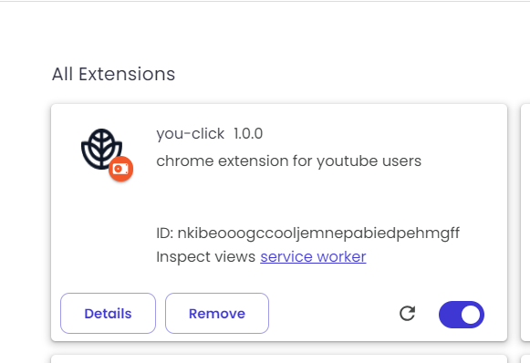
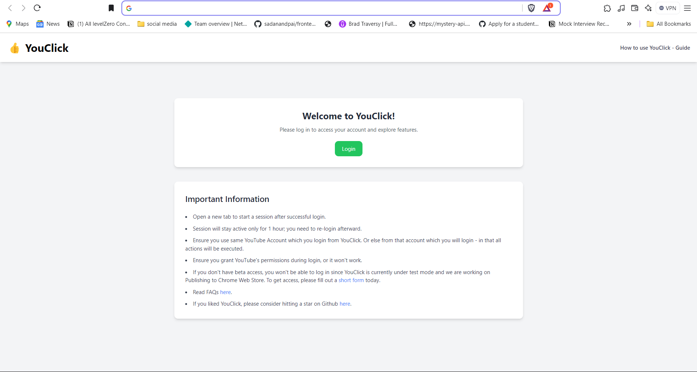
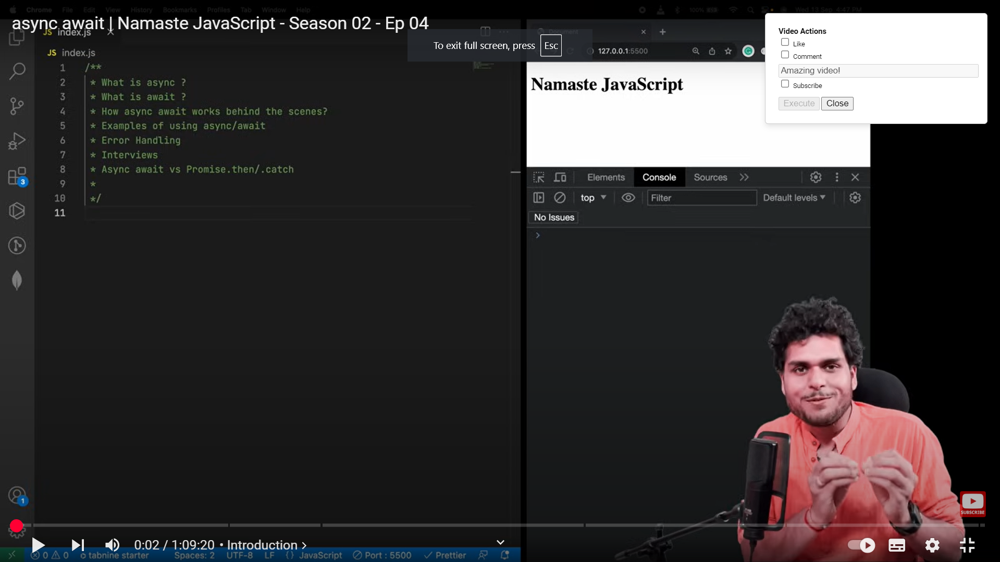

# Welcome to YouClick:

Support your favorite YouTuber with YouClick. It is Free, open source forever, aims to make win-win situation for both youtuber and consumer! Say goodbye to manual like, comment and subscribe!

## Why Behind YouClick:

You might have heard youtuber requesting you to like, comment and subscribe to their channel, ever wonder why they tell you in each video?? because we tend to binge watch and forget to shower the support to that video or youtube channel just because we are LAZY to exit the full screen and manually do the work! Imagine you are watching a playlist of 100 videos, will you exit the full screen everytime and comment?? This includes a lot of friction and high probability that you will not comment and like on each video. And due to this, your favorite youtuber might not get the appreciation he/she deserves. This is exactly where YouClick took a birth.

## Key features:

1. Automated Like: Say goodbye to exiting full screen or forgetting to like.
2. Automated Comment: You can write your comment in popup without exiting full screen or just go ahead with default comment:)
3. Automated Subscribe: If you are loving the playlist - consider subscribing, without exiting full screen.

All under "one single click"

## How to Install YouClick Chrome Extension Guide

Check out this short Loom video to understand better:

    <a target="_blank" href="https://www.loom.com/share/af6b23ec74714221be0d28f8b2c68670">
      
YouClick Demo and Install Guide - Watch Video

    </a>
    
  

   

## Installation Guide Steps if you don't want to prefer video:

1. Go over https://github.com/samyakshah3008/YouClick and click on code and click on download ZIP

2. Uncompress zip folder

3. Go to your browser's extension location and turn on developer mode
   

4. Click on load unpacked
   

5. Go to uncompressed folder location and you should see four folders

6. Click on extension

7. Click on dist
   

8. Hit enter or select folder button

9. You will see this

10. Now create a new tab in your browser, if you have any other extension, you will get a popup - click on "keep it"

11. You will see this then -

12. Read instructions and login to a google account which is same as YouTube account which you want to execute these actions. (If you don't have a beta access - please fill this form today as YouClick is on test mode and not available on Chrome Web Store - <a href="https://you-click.vercel.app/beta-access" target="_blank">here</a>)

13. Once you successfully login, don't forget to create a new tab to start a new session of 1 hour.

14. Now, go to YouTube and go over any YouTube video, you will get this popup

check boxes which you want and click on execute.

15. To confirm that video is liked and commented, you can refresh the browser to confirm.

## FAQs:

1. **I am not able to login to YouClick**

   - Ensure you have beta access.
   - If you're still unable to login, email: `samyakshah3008@gmail.com`.

2. **I have filled the Beta access form. When can I expect approval?**

   - You can expect a response within 24 hours.

3. **Why can’t I find YouClick in the Chrome Web Store?**

   - YouClick is in test mode with a limited capacity of 100 users.
   - Publishing on the Chrome Web Store is pending due to ongoing procedures.

4. **I am a YouTuber and loved this idea. Can I share it with my community and get bulk access?**

   - Email: `samyakshah3008@gmail.com` to request bulk access.
   - We will contact you after completing the necessary procedures.

5. **Will YouClick be free forever?**

   - A free plan with limited use will always be available.
   - Business plans with minimal pricing will be introduced for bulk users.

6. **I executed like, comment, and subscribe, but it’s not showing.**

   - YouTube APIs may take some time to reflect the changes.
   - Please wait for a while as it’s not immediate in some cases.

7. **I waited, but my comment still isn’t showing.**
   - Ensure the account you used to sign up for YouClick matches the account you’re using on YouTube.
   - If the issue persists, email: `samyakshah3008@gmail.com`.
